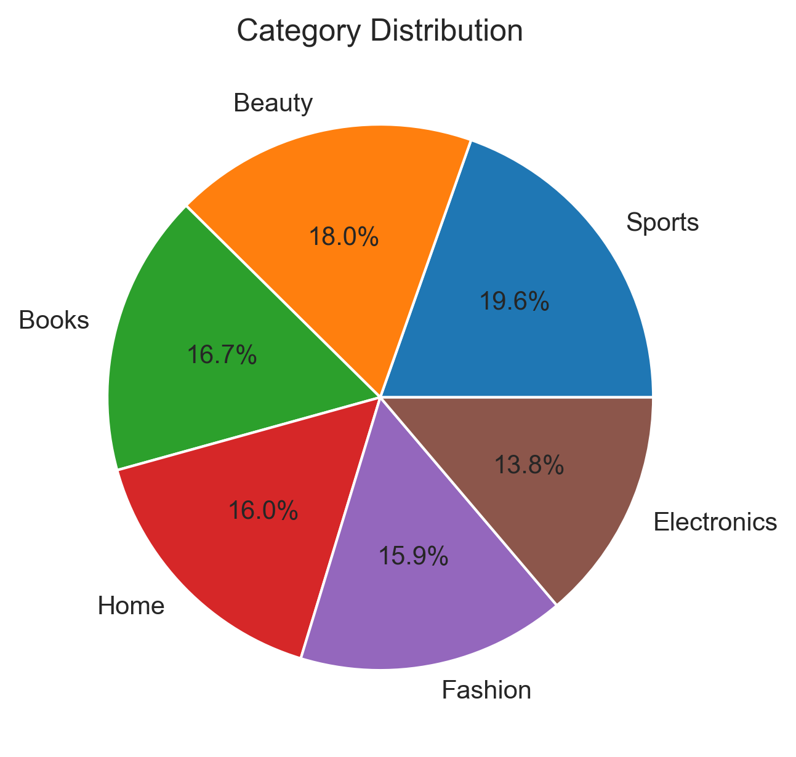
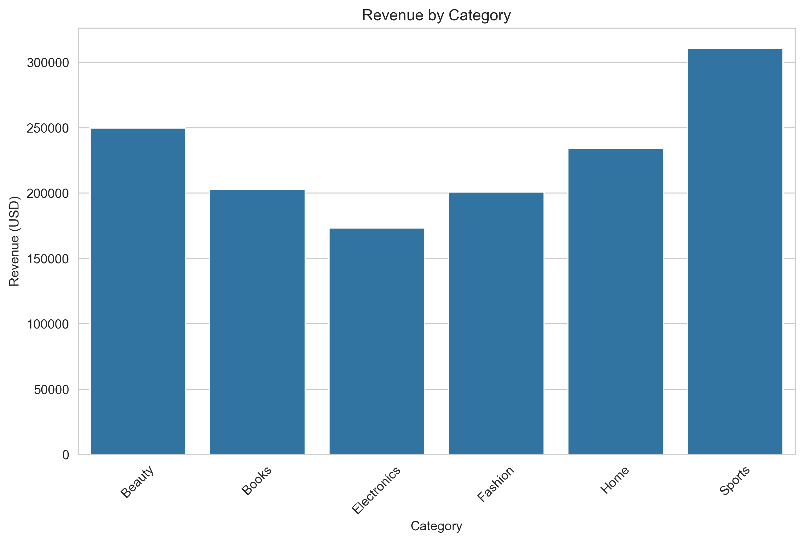
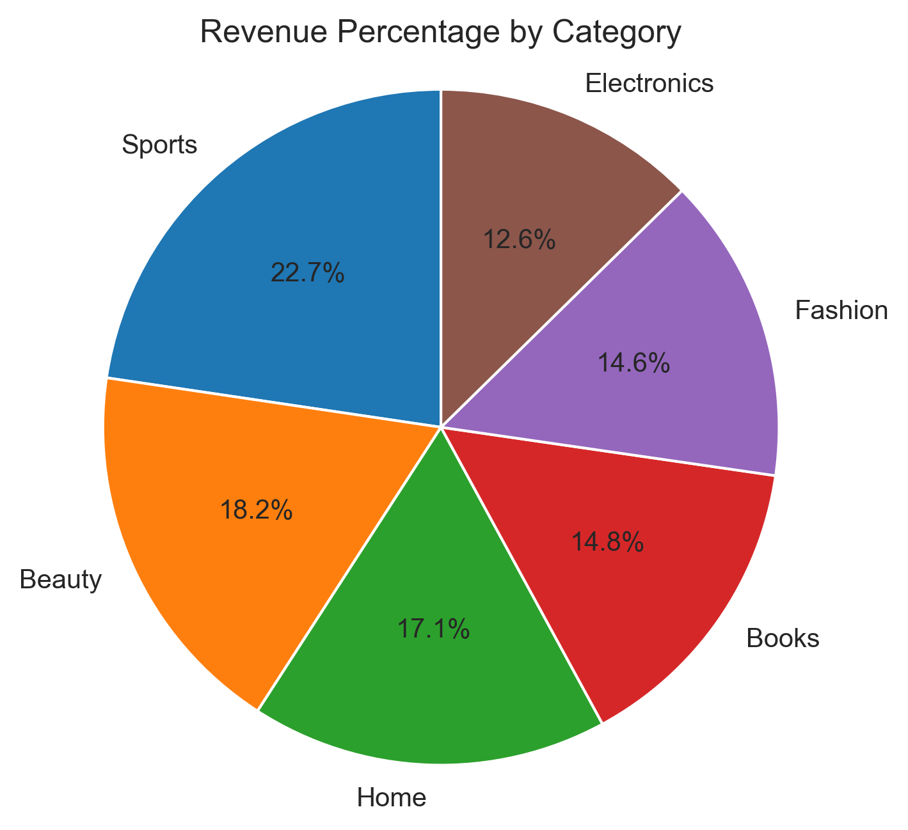
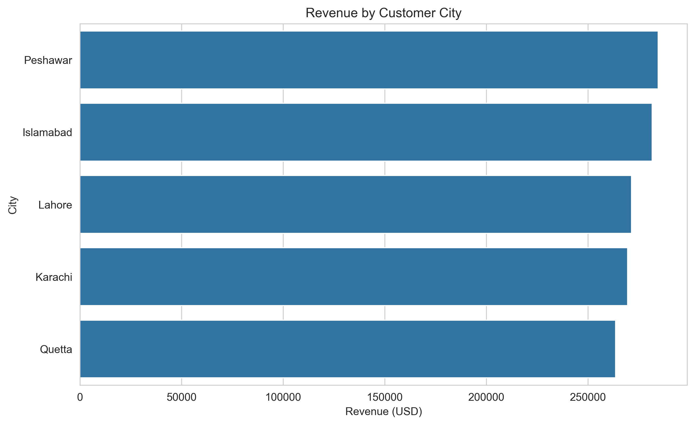
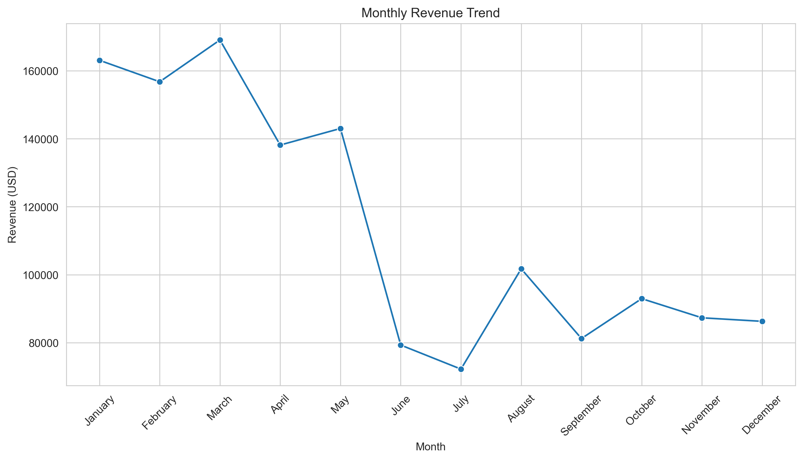
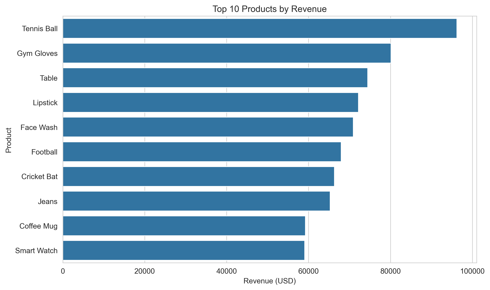
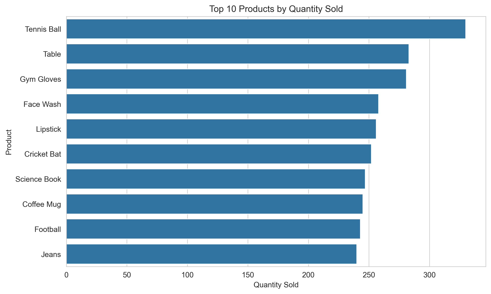

# 📊 Retail Sales Intelligence Dashboard


An end-to-end **Exploratory Data Analysis (EDA)** project that analyzes retail sales data to uncover product performance, customer purchasing behavior, revenue trends, and regional sales distribution using Python.

---

# Table of Contents

- [Project Overview](#project-overview)
- [Dataset](#dataset)
- [Tech Stack](#tech-stack)
- [Project Structure](#project-structure)
- [Analysis Performed](#analysis-performed)
- [Visualizations](#visualizations)
- [Results & Business Insights](#results--business-insights)
- [Key Performance Indicators](#key-performance-indicators)
- [Future Improvements](#future-improvements)
- [How to Run](#how-to-run)

---

# Project Overview

The objective of this project is to perform exploratory data analysis on a retail sales dataset to identify sales trends, customer purchasing behavior, product performance, and regional demand. The project demonstrates the complete data analysis workflow, including data cleaning, preprocessing, visualization, and business insight generation.

---

# Dataset

**Source:** Public Retail Sales Dataset (Kaggle)

### Features

- Product ID
- Product Name
- Category
- Price (USD)
- Quantity Sold
- Total Sales (USD)
- Order Date
- Customer City

---

# Tech Stack

- Python
- Pandas
- NumPy
- Matplotlib
- Seaborn
- Jupyter Notebook

---

# Project Structure

```
Retail-Sales-Intelligence-Dashboard/

│
├── data/
│   └── retail_sales_dataset.csv
│
├── Retail_Sales_Intelligence_Dashboard.ipynb
│
├── images/
│   ├── category_revenue.png
│   ├── city_wise_revenue.png
│   ├── monthly_revenue_trend.png
│   ├── top_10_product_by_revenue.png
│   ├── top_10_product_by_quantity_sold.png
│   ├── category_distribution_percentage.png
│   ├── category_revenue_percentage.png
│   ├── correlation_heatmap.png
│   ├── monthly_sales_trend.png
│
├── README.md

```

---

# Analysis Performed

- Data Cleaning
- Missing Value Analysis
- Duplicate Detection
- Exploratory Data Analysis (EDA)
- Product Performance Analysis
- Category-wise Revenue Analysis
- Customer City Analysis
- Monthly Revenue Trend Analysis
- Correlation Analysis
- Business Insight Generation
- KPI Reporting

---

# Visualizations

## Category Distribution Percentage



---

## Revenue by Category



---

## Category Revenue Percentage



---

## Revenue by Customer City



---

## Monthly Revenue Trend



---

## Top 10 Products by Revenue



---

## Top 10 Products by Quantity Sold



---

# Results & Business Insights

## Revenue by Category

- Sports generated the highest revenue among all categories.
- Beauty and Home also contributed significantly to overall sales.
- Electronics recorded the lowest revenue.

---

## Revenue by Customer City

- Peshawar generated the highest revenue.
- Revenue remained relatively balanced across all cities.
- Quetta generated the lowest revenue.

---

## Monthly Revenue Trend

- Revenue peaked during March.
- Sales experienced a significant decline during June and July.
- Revenue recovered during August and remained relatively stable afterward.

---

## Top Products

- Tennis Ball generated the highest revenue and sales volume.
- Gym Gloves ranked second in total revenue.
- Table, Lipstick, and Face Wash consistently ranked among the top-performing products.

---

## Business Recommendations

- Increase inventory for high-performing products.
- Focus marketing campaigns on Sports products.
- Improve promotional strategies for Electronics.
- Plan seasonal campaigns before peak sales months.
- Monitor low-performing products for pricing or inventory optimization.

---

# Key Performance Indicators

- Total Revenue Generated
- Total Quantity Sold
- Average Product Price
- Number of Products
- Number of Categories
- Number of Customer Cities

---

# Future Improvements

- Power BI Dashboard
- Interactive Plotly Dashboard
- Sales Forecasting
- Customer Segmentation
- Product Recommendation System
- Geographic Sales Mapping

---

# How to Run

Clone the repository

```bash
git clone https://github.com/sandipan2598/retail-sales-intelligence-dashboard.git
```

Install dependencies

```bash
pip install -r requirements.txt
```

Launch Jupyter Notebook

```bash
jupyter notebook
```

Open

```
Retail_Sales_Intelligence_Dashboard.ipynb
```

Run all cells sequentially.

---

# Author

**Sandipan Dey**